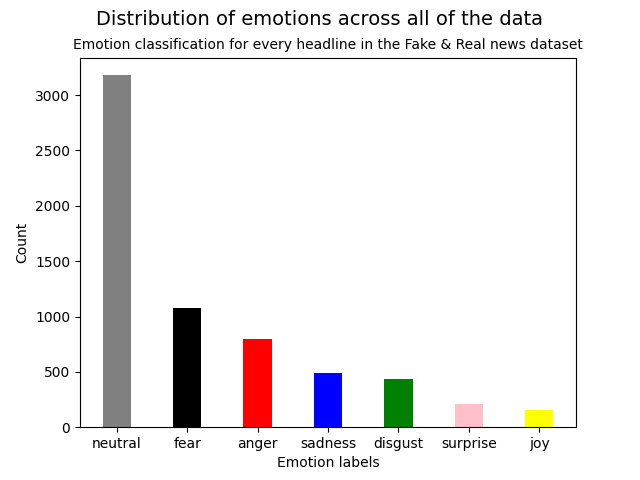
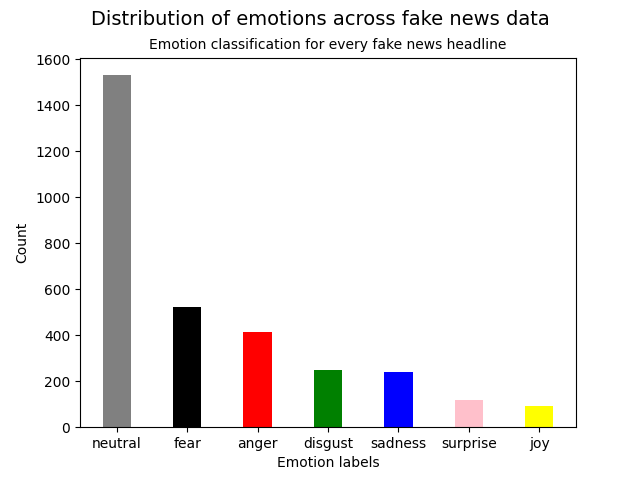
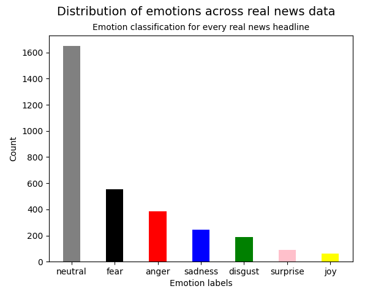

[](https://classroom.github.com/a/BhnScEmU)
[](https://classroom.github.com/online_ide?assignment_repo_id=10838533&assignment_repo_type=AssignmentRepo)

# **Assignment 4 - Using finetuned transformers via HuggingFace**
## **Cultural Data Science - Language Analytics** 
#### Author: Rikke Uldbæk (202007501)
#### Date: 13th of April 2023

<br>

# **4.1 GitHub link**
The following link is a link to the GitHub repository of assignment 4 in the course Language Analytics (F23.147201U021.A). Within the GitHub repository all necessary code are provided to reproduce the results of the assignment.

https://github.com/rikkeuldbaek/assignment-4-using-finetuned-transformers-rikkeuldbaek

<br>

# **4.2 Description**
For this assignment, I have used a finetuned transformer model from ```HuggingFace``` to extract information from a *Fake or Real News dataset*.  More specific, I have used the emotion classifier model ```j-hartmann/emotion-english-distilroberta-base``` to etract emotion scores for every headline in the *Fake or Real News dataset*, in order to compare the emotion distributions across *all* news headlines, only *fake* news headlines, and only *real* news headlines. The emotion classification model is available via ```HuggingFace```, and serves as a tool to classify emotions in English text data and predict seven emotion classes. These emotion seven classes are: neutral, fear, anger, disgust, sadness, surprise, and joy. These emotion scores have then been plotted in a bar plot in order to illustrate the distribution of emotions across all of the news, *only* the real news, and *only* the fake news. The results are compared and discussed in the results section. 

<br>

# **4.3 Data**
This dataset consists of around 6000 *Fake or Real News* articles and their headlines. In this assignment I will only be using the headlines in order to classify their emotion scores. The previously mentioned emotion classification model provides a score for each of the seven emotion classes per headline. The largest score for a given emotion is assumed to be the most likely prediction of a correct emotion class, hence the headline is given that emotion label. The data is available via Kaggle, please see resources for further information. 

<br>


# **4.4 Repository Structure**
The scripts require a certain folder structure, thus the table below presents the required folders and their description and content.

|Folder name|Description|Content|
|---|---|---|
|```src```|emotion classifier scripts |```emotion_classifier_ALL.py```, ```emotion_classifier_FAKE.py```, ```emotion_classifier_REAL.py```|
|```data```|*Fake or Real News* .csv file|```fake_or_real_news.csv```|
|```out```|saved .png files of plots|```emotion_distribution_all.png```, ```emotion_distribution_fake.png```, ```emotion_distribution_real.png```|

The three scripts ```emotion_classifier_ALL.py```, ```emotion_classifier_FAKE.py```, and ```emotion_classifier_REAL.py``` produces three plots of the distributions of emotions on *all* data, only *fake* news data, and only *real* news data, respectively. These three plots are located in the folder ```out```.

<br>


<br>

# **4.5 Usage and Reproducibility**
## **4.5.1 Prerequisites** 
In order for the user to be able to run the code, please make sure to have bash and python 3 installed on the used device. The code has been written and tested with Python 3.9.2 on a Linux operating system. In order to run the provided code for this assignment, please follow the instructions below.

<br>

## **4.5.2 Setup Instructions** 
**1) Clone the repository**
```python
git clone https://github.com/rikkeuldbaek/assignment-4-using-finetuned-transformers-rikkeuldbaek
 ```

 **2) Setup** <br>
Setup virtual environment (```LA4_env```) and install required packages.
```python
bash setup.sh
```

<br>

## **4.5.3 Run the script** 
In order to run the three emotion classification scripts, please run the following command in the terminal after setting up. Please note that the three scripts take quite some time to run. 
```python
bash run.sh
```


<br>


# **4.6 Results**
The results of the emotion classification of *all* the data's headlines, only *fake* news headlines, and only *real* news headlines are visualized using barplots. The barplots show the distribution of counts across seven emotions. Every emotion is colour coded appropriately to reflect a mapping between emotion and colour. The three plots show same distributional tendencies, with the vast majority of headlines being classified as *neutral*. The only visible change in the distribution occurs between *sadness* and *disgust* in the *fake* news headlines, other than that there are not much difference between the plots. One could maybe expect *fake* news to have a more negative emotion distribution (i.e, a larger count frequency of *anger*, *fear*, *sadness*, and *disgust* ), however this seems not to be the case. This could indicate that emotions might not be as strong of a predictor of *fake* or *real* news. However, a statistical test should be conducted in order to conclude whether or not there is a difference in the emotion distributions. 

<br>

|All news headlines|Fake news headlines|Real news headlines|
|---|---|---|
||| |

<br>

# **Resources**
[HuggingFace - Emotion classifier](https://huggingface.co/j-hartmann/emotion-english-distilroberta-base)

[Data - Fake or Real News](https://www.kaggle.com/datasets/jillanisofttech/fake-or-real-news)

